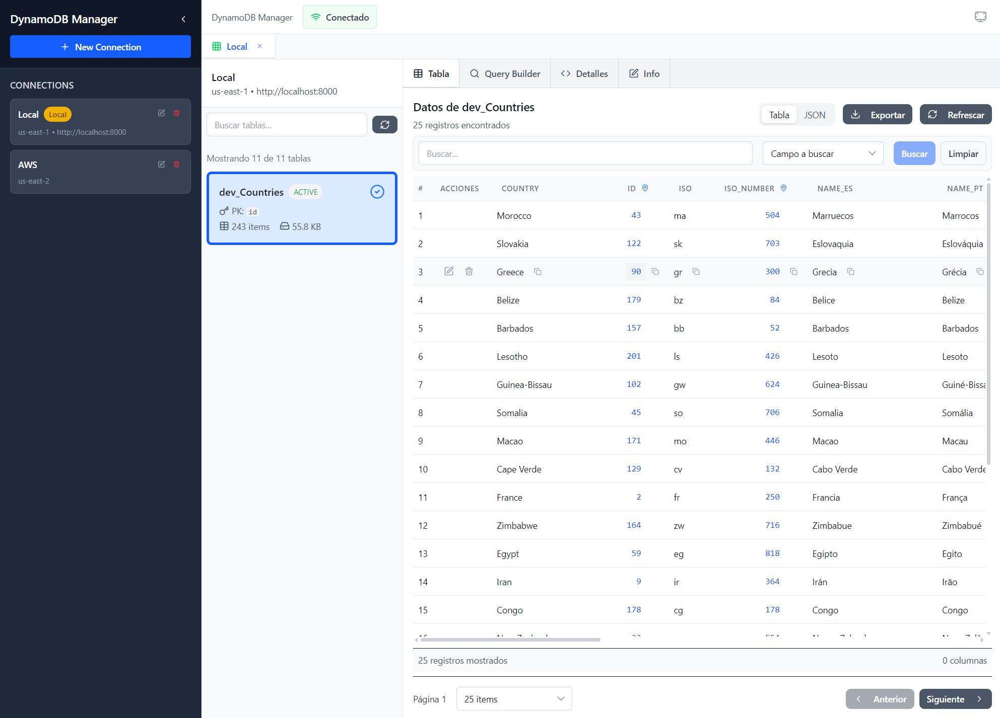

# DynamoDB Manager 🚀

Una aplicación de escritorio moderna, potente y **completamente gratuita** para administrar bases de datos DynamoDB. Construida con Svelte 5, SvelteKit y Electron para proporcionar una experiencia similar a Studio 3T para operaciones DynamoDB.

## 🌟 ¿Por qué DynamoDB Manager?

Mientras el mercado está inundado de clientes DynamoDB costosos que cobran precios premium por funcionalidad básica, **DynamoDB Manager** ofrece una solución integral que es:

- ✅ **100% Gratuita y Código Abierto** - Sin suscripciones, sin limitaciones de funciones
- ✅ **Lista para Docker** - Perfecta para desarrollo con contenedores DynamoDB Local
- ✅ **Lista para Producción** - Conecta a instancias reales de AWS DynamoDB con total seguridad
- ✅ **Multiplataforma** - Soporte para Windows, macOS y Linux
- ✅ **Interfaz Moderna** - Diseño limpio e intuitivo inspirado en MongoDB Studio 3T
- ✅ **Operaciones CRUD Completas** - Crear, Leer, Actualizar, Eliminar con funciones avanzadas

## 🎯 Características

### 🔗 Gestión de Conexiones

- **Múltiples conexiones simultáneas** - Trabaja con varias instancias de DynamoDB a la vez
- **Almacenamiento seguro de credenciales** - Tus claves AWS se almacenan local y seguramente
- **Pruebas de conexión** - Validación automática antes de conectar
- **Soporte para Docker** - Conecta sin problemas a contenedores DynamoDB Local
- **Reconexión automática** - Mecanismo inteligente de reintento para conexiones interrumpidas

### 📊 Operaciones de Datos

- **Explorador de tablas avanzado** - Navega todas las tablas con información de esquema
- **Modos de vista dual** - Cambia entre vista de tabla y vista JSON instantáneamente
- **Paginación inteligente** - Navega grandes conjuntos de datos eficientemente
- **Filtrado potente** - Busca y filtra datos por cualquier campo
- **Capacidades de exportación** - Descarga tus datos como JSON para respaldo
- **Operaciones por lotes** - Maneja múltiples registros eficientemente

### 🛠️ Experiencia del Desarrollador

- **Interfaz con pestañas** - Trabaja con múltiples tablas simultáneamente
- **Resaltado de sintaxis** - Datos JSON con hermosa codificación de colores
- **Validación en tiempo real** - Verificación de tipos DynamoDB (S, N, BOOL, etc.)
- **Manejo de errores** - Mensajes de error claros y sugerencias de recuperación
- **Optimizado para rendimiento** - Carga rápida incluso con grandes conjuntos de datos

## 🚀 Inicio Rápido

### Prerrequisitos

- Node.js 18+
- npm o yarn

### Instalación

1. **Clona el repositorio**

   ```bash
   git clone https://github.com/Draka/dynamodb-manager.git
   cd dynamodb-manager
   ```

2. **Instala dependencias**

   ```bash
   npm install
   ```

3. **Ejecuta en modo desarrollo**

   ```bash
   # Versión web
   npm run dev

   # Aplicación de escritorio
   npm run electron:dev
   ```

4. **Construye para producción**

   ```bash
   # Build web
   npm run build

   # Aplicación de escritorio
   npm run electron:build
   ```

### 🐳 Uso con Docker DynamoDB Local

¡Perfecto para desarrollo! Ejecuta DynamoDB Local en un contenedor:

```bash
# Inicia DynamoDB Local
docker run -p 8000:8000 amazon/dynamodb-local

# En DynamoDB Manager, conecta con:
# - Región: us-east-1
# - Access Key: dummy
# - Secret Key: dummy
# - Endpoint: http://localhost:8000
```

### ☁️ Conectando a AWS DynamoDB

1. Haz clic en "Nueva Conexión"
2. Ingresa tus credenciales AWS:
   - **Access Key ID**: Tu clave de acceso AWS
   - **Secret Access Key**: Tu clave secreta AWS
   - **Región**: Tu región AWS preferida (ej: us-east-1)
3. Haz clic en "Probar Conexión" para verificar
4. ¡Comienza a administrar tus tablas!

## 📸 Capturas de Pantalla

### Interfaz Principal - Vista de Pestañas Multi-Conexión



**Lo que ves:**

- **Panel Izquierdo**: Múltiples conexiones (DynamoDB Local + AWS) con estado de conexión
- **Panel Central**: Explorador de tablas mostrando todas las tablas disponibles con conteo de items
- **Panel Derecho**: Visualizador de datos con modos duales (Tabla/JSON) y paginación inteligente
- **Pestañas Superiores**: Workspace multi-conexión - trabaja con varias bases de datos simultáneamente
- **Características Visibles**: Búsqueda/filtros, opciones de exportación, controles de paginación, vista de tabla responsiva

Esta captura demuestra el flujo de trabajo completo: conectándose tanto a DynamoDB local de Docker como a AWS, navegando tablas y visualizando datos con la interfaz profesional inspirada en Studio 3T.

## 🏗️ Arquitectura

- **Frontend**: Svelte 5 + SvelteKit 2.22.0
- **Escritorio**: Electron 38.0.0 + electron-builder
- **Estilos**: TailwindCSS 4.0 + Lucide Icons
- **Integración AWS**: @aws-sdk/client-dynamodb + @aws-sdk/lib-dynamodb
- **Sistema de Build**: Vite 7.0.4

## 🤝 Contribuir

¡Damos la bienvenida a contribuciones! Así es como puedes ayudar:

### 🍴 Fork y Enviar Cambios

1. **Fork del repositorio**
   - Haz clic en el botón "Fork" en la parte superior de este repositorio
   - Clona tu fork: `git clone https://github.com/yourusername/dynamodb-manager.git`

2. **Crea una rama de característica**

   ```bash
   git checkout -b feature/caracteristica-increible
   ```

3. **Haz tus cambios**
   - Sigue el estilo de código existente
   - Agrega pruebas si es aplicable
   - Actualiza la documentación según sea necesario

4. **Prueba tus cambios**

   ```bash
   npm run test
   npm run lint
   npm run build
   ```

5. **Envía un Pull Request**
   - Push a tu fork: `git push origin feature/caracteristica-increible`
   - Abre un Pull Request con una descripción clara de tus cambios

### 🐛 Reportes de Errores y Solicitudes de Características

- **Reportes de Errores**: Usa la pestaña GitHub Issues con la etiqueta "bug"
- **Solicitudes de Características**: Usa la pestaña GitHub Issues con la etiqueta "enhancement"
- **Preguntas**: Usa la pestaña GitHub Discussions

### 💡 Directrices de Desarrollo

- Sigue los patrones de código existentes y convenciones de nomenclatura
- Escribe mensajes de commit claros
- Mantén los pull requests enfocados en una sola característica/corrección
- Agrega comentarios JSDoc para nuevas funciones
- Prueba en múltiples plataformas cuando sea posible

## 📚 Scripts Disponibles

```bash
# Desarrollo
npm run dev                    # Servidor de desarrollo web (localhost:5174)
npm run electron:dev           # Modo desarrollo Electron

# Construcción
npm run build                  # Build web de producción
npm run preview                # Vista previa del build de producción
npm run electron:pack          # Empaquetado local de Electron
npm run electron:build         # Build multiplataforma de Electron
npm run electron:build-win     # Build específico para Windows
npm run electron:build-mac     # Build específico para macOS
npm run electron:build-linux   # Build específico para Linux

# Calidad
npm run test                   # Ejecutar pruebas unitarias (Vitest)
npm run test:e2e               # Ejecutar pruebas E2E (Playwright)
npm run lint                   # Análisis de código ESLint
npm run format                 # Formateo de código Prettier
```

## 🛡️ Seguridad

- **Almacenamiento local**: Todas las credenciales se almacenan localmente en tu máquina
- **Sin telemetría**: No recolectamos ningún dato de uso
- **Mejores prácticas AWS**: Sigue las directrices de seguridad del AWS SDK
- **Código abierto**: Transparencia total - inspecciona el código tú mismo

## 📄 Licencia

Este proyecto está licenciado bajo la Licencia MIT - consulta el archivo [LICENSE](LICENSE) para más detalles.

## 🙏 Reconocimientos

- Inspirado en el diseño de interfaz de MongoDB Studio 3T
- Construido sobre los increíbles ecosistemas de Svelte y Electron
- Gracias al equipo del AWS SDK por el excelente soporte de DynamoDB
- Agradecimientos especiales a todos los contribuidores que ayudan a hacer esta herramienta mejor

## 📞 Soporte

- 📖 **Documentación**: Consulta la [carpeta docs](./docs) para guías detalladas
- 🐛 **Issues**: Reporta errores vía [GitHub Issues](https://github.com/Draka/dynamodb-manager/issues)
- 💬 **Discusiones**: Únete a la conversación en [GitHub Discussions](https://github.com/Draka/dynamodb-manager/discussions)
- ⭐ **Marca el repo con estrella** si lo encuentras útil!

---

**Hecho con ❤️ por desarrolladores, para desarrolladores. Gratuito para siempre.**

> _"Porque las buenas herramientas no deberían costar una fortuna."_
